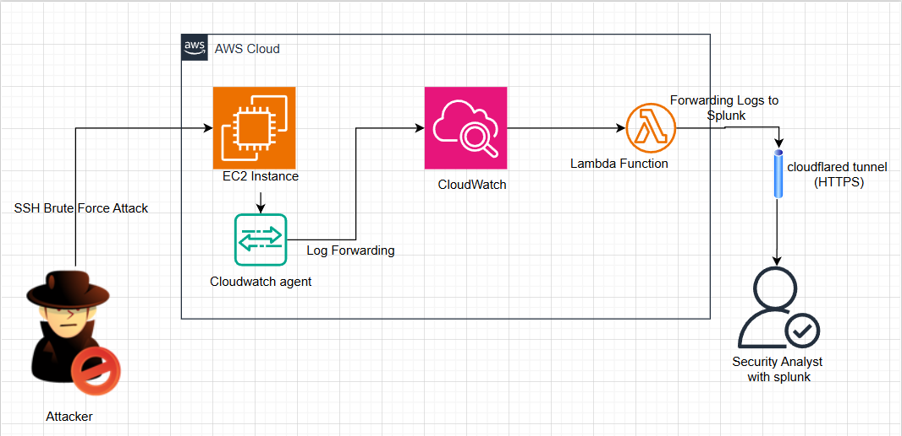
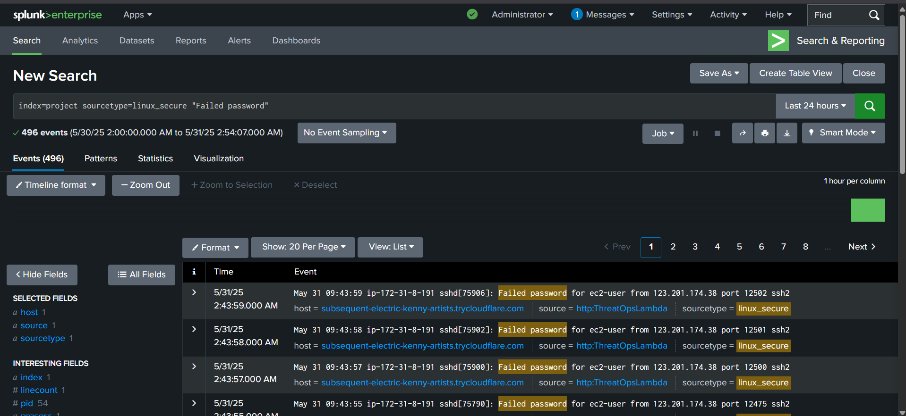

# ThreatOps Lab: Real-Time Detection Pipeline using AWS and Splunk

A hands-on cybersecurity project to simulate and detect SSH brute-force attacks in real time using AWS infrastructure and Splunk. This lab demonstrates a complete pipeline from cloud resource setup to log analysis and threat detection.

---

## 🛠 Phase 1: Infrastructure Setup

### ✅ EC2 Instance Setup
- Launched a `t2.micro` Ubuntu EC2 instance in the `ap-south-1` region.
- Configured with a security group to allow SSH (port 22).
- Created and attached a key pair (PEM file) to access the instance via SSH.

### ✅ CloudWatch Configuration
- Installed and configured the Amazon CloudWatch Agent on the EC2 instance.
- Created a CloudWatch Log Group `ThreatOpsEC2Logs` to receive log data.
- Configured the agent to forward logs from `/var/log/secure`.

### ✅ Lambda Setup
- Created an AWS Lambda function (Python) to fetch logs from CloudWatch in real time.
- Integrated the Lambda function with CloudWatch Log Group using triggers.

### ✅ Splunk HEC and Tunneling
- Installed Splunk Enterprise on the local Windows machine.
- Enabled HTTP Event Collector (HEC); created a token `ThreatOpsCloudWatch`.
- Used `Cloudflared` to expose local Splunk HEC (port 8088).
- Lambda used the tunnel URL as the `SPLUNK_HEC_URL` to forward logs.

---

## 🧨 Phase 2: Attack Simulation

- Performed Hydra SSH brute-force attack from Kali Linux targeting EC2 public IP.

```bash
hydra -l <username> -P <path to password list> ssh://<ec2-public-ip>
```

- Simultaneously ran Nmap port scans to simulate noisy malicious behavior.

---

## 📦 Phase 3: Log Flow Architecture

### Architecture Diagram


### 🔹 EC2 Log Generation
- SSH attempts are logged in `/var/log/secure`.

### 🔹 CloudWatch Agent
- Installed via `.rpm` with custom `cloudwatch-config.json`.
- Streams logs from EC2 to CloudWatch log group in real time.

### 🔹 Lambda → Splunk
- Lambda triggered on new CloudWatch logs.
- Parses and forwards logs to Splunk via the tunneled HEC endpoint.
- Format used: `linux_secure` sourcetype for easy parsing in Splunk.

---

## 🔍 Phase 4: Log Analysis & Brute Force Detection in Splunk

### ✅ SPL Commands Used

#### Extracting High-Frequency IPs
```spl
index="project" sourcetype="linux_secure" action=REJECT
| stats count by srcaddr
| sort -count
```

#### Detecting Port Scanning (More than 20 unique ports)
```spl
index="project" sourcetype="_json" action=REJECT
| rex field=message "(?<dstport>\d{2,5})"
| stats dc(dstport) as unique_ports by srcaddr
| where unique_ports > 20
```

---

## 📸 Screenshots

### SSH Brute Force Source IP Detection


### Login Outcome Pie Chart


### Sample Log Events in Splunk



## ✅ Results

- Identified the attacker's source IP address.
- Detected multiple failed attempts to SSH on port 22.
- Confirmed successful log ingestion and near real-time pipeline.

---

## 📌 Key Technologies

- AWS EC2, CloudWatch, Lambda
- Splunk HEC, Cloudflared
- Hydra, Nmap, Kali Linux

---

## 💡 Takeaways

- Built an end-to-end detection pipeline from scratch.
- Gained practical experience with log forwarding, real-time alerting, and SPL analysis.
- Simulated real-world brute-force attacks and validated detection effectiveness.

---

## ✅ Project Completion Summary

- ✅ Real-time SSH Attack Detection Implemented
- ✅ Logs Flowing from EC2 → CloudWatch → Lambda → Splunk
